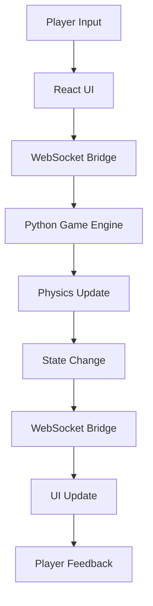

# Code Quest: Architecture Overview

## Architecture Design

Code Quest uses a hybrid architecture combining Python Arcade for game mechanics and React/Tailwind for UI components:

### Backend (Python Arcade)
- Game Engine: Python Arcade for core game logic and OpenGL-accelerated graphics
- Physics Engine: Built-in Arcade Physics for character movement and collisions
- State Management: Custom game state manager for level progression and player stats
- Asset Management: Integrated Arcade resource management for sprites and sounds

### Frontend (React/Tailwind)
- UI Framework: React for composable user interface components
- Styling: Tailwind CSS for responsive and maintainable styling
- Code Editor: Monaco-based code editor for puzzle solutions
- Game HUD: Overlay components for score, inventory, and status

### Communication Layer
- WebSocket connection between Python backend and React frontend
- JSON message protocol for state synchronization
- Event system for bidirectional communication

## System Components

1. Game Core
   - Level Manager
   - Physics System
   - Collision Detection
   - Character Controller

2. UI Layer
   - Main Menu
   - Code Editor
   - Game Overlay
   - Dialog System

3. Puzzle System
   - Code Execution Engine
   - Validation System
   - Hint Generator
   - Progress Tracker

4. Asset Pipeline
   - Sprite Management
   - Sound System
   - Level Data
   - Code Templates

## Data Flow



## Directory Structure

```
code-quest/
├── backend/
│   ├── game/
│   │   ├── engine.py
│   │   ├── physics.py
│   │   └── state.py
│   ├── puzzles/
│   │   ├── validator.py
│   │   └── templates/
│   └── server.py
├── frontend/
│   ├── src/
│   │   ├── components/
│   │   ├── editor/
│   │   └── overlay/
│   └── public/
│       └── assets/
└── shared/
    ├── protocol.py
    └── types.ts
```
